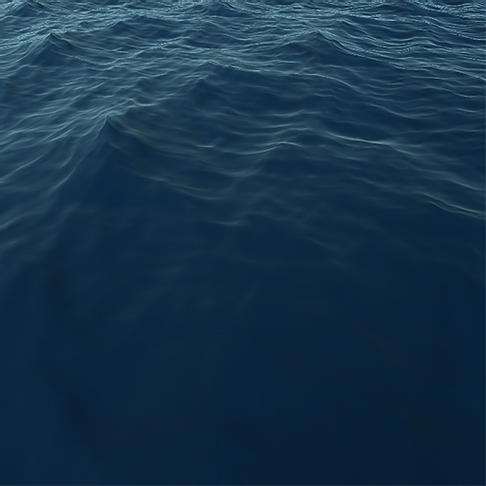

# Phillips-Ocean

This is a ocean project  using Phillips spectrum to generate the waves. Some time around 2001 Jerry Tessendorf released a paper called 'Simulating Ocean Water' and in it he out lined all the methods and math need for simulating oceans. In this paper the math for using Phillips spectrum was outlined and I came across a [blog](http://www.keithlantz.net/2011/11/ocean-simulation-part-two-using-the-fast-fourier-transform/) that had converted the math to code.

His project was written in C++ so it was just a matter of converting that to a C# script for Unity. I have left all the math the same but have made some changes and restructured the code a bit and the Fourier transform now runs on its own thread resulting in a big performance increase.

List of water projects.

[Ceto](https://github.com/Scrawk/Ceto)\
[Phillips ocean.](https://github.com/Scrawk/Phillips-Ocean)\
[Brunetons Ocean.](https://github.com/Scrawk/Brunetons-Ocean)\
[Tiled-directional flow.](https://github.com/Scrawk/Tiled-Directional-Flow)\
[PBD Fluid sim.](https://github.com/Scrawk/PBD-Fluid-in-Unity)
